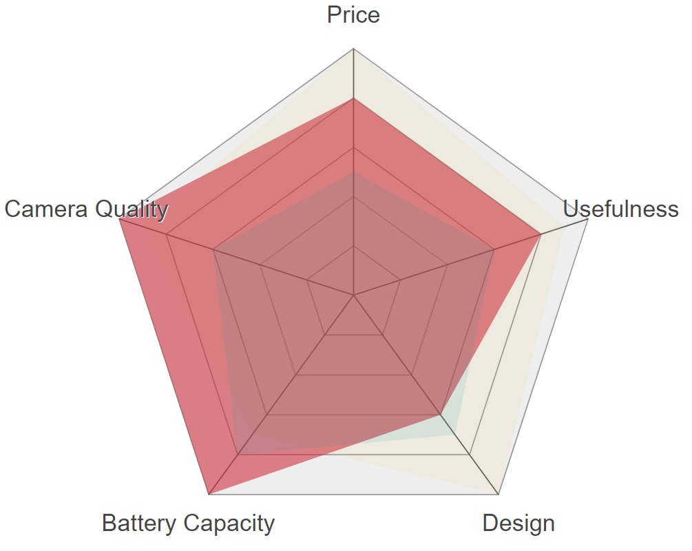

# SVG-Spider-Chart



SVG-based spider chart, a.k.a. radar chart, based on [Derhuerst's version](https://github.com/derhuerst/svg-radar-chart). The main differences are:

- The virtual dom library can be injected, for example, you can inject [mithril's](mithriljs.org) `m` function.
- By default, a spider chart is displayed instead of a radar chart, i.e. using linear scale lines instead of circles.
- It provides a Mithril component factory, `SpiderChartFactory`, to create `SpiderCharts` by injecting mithril's `m` function.
- Using Typescript also provides type definitions.

## Usage

You can either use the `SpiderChartFactory` to create your own `SpiderChart` by injecting the virtual dom function factory (in the example below, mithril is used). Or alternatively, you can import the `render` function, and render the content inside your own SVG (it generates the plain chart, without `svg` element around it).

```ts
import m from 'mithril';
import {
  SpiderChartFactory,
  SpiderColumns,
  SpiderData,
  SpiderOptions,
} from 'svg-spider-chart';


const columns = {
  price: 'Price',
  useful: 'Usefulness',
  design: 'Design',
  battery: 'Battery Capacity',
  camera: 'Camera Quality',
} as SpiderColumns;

const data = [
  {
    // iphone
    color: '#edc951',
    price: 1,
    battery: 0.7,
    design: 1,
    useful: 0.9,
    camera: 0.9,
  },
  {
    // galaxy
    color: '#cc333f',
    price: 0.8,
    battery: 1,
    design: 0.6,
    useful: 0.8,
    camera: 1,
  },
  {
    // nexus
    color: '#00a0b0',
    price: 0.5,
    battery: 0.8,
    design: 0.7,
    useful: 0.6,
    camera: 0.6,
  },
] as SpiderData[];

// Inject the m function
const SpiderChart = SpiderChartFactory(m);

// Render the chart
m.render(
  document.body,
  m(SpiderChart, {
    id: 'demo-target',
    columns,
    data,
    width: '100%',
    viewBox: '0 0 130 100',
    options: {
      size: 100,
      scales: 5,
      scaleType: 'spider',
      shapeProps: (data) => ({
        className: 'shape',
        fill: data.color as string,
      }),
    } as Partial<SpiderOptions>,
  }),
);
```

```ts
import m from 'mithril';
import { render } from 'svg-spider-chart';

// Use the render function
const renderer = render(m);
const spiderChart = renderer(columns, data, options);
```

## Default options

The following default options are used: tweak them as you see fit.

```ts
const defaults = {
  size: 100, // size of the chart (including captions)
  axes: true, // show axes?
  scales: 3, // show scale circles?
  scaleType: 'spider',
  captions: true, // show captions?
  captionsPosition: 1.2, // where on the axes are the captions?
  smoothing: noSmoothing, // shape smoothing function
  axisProps: () => ({ className: 'axis' }),
  scaleProps: () => ({ className: 'scale', fill: 'none' }),
  shapeProps: () => ({ className: 'shape' }),
  captionProps: () => ({
    className: 'caption',
    'text-anchor': 'middle',
    'font-size': 3,
    'font-family': 'sans-serif',
  }),
} as Partial<SpiderOptions>;
```
